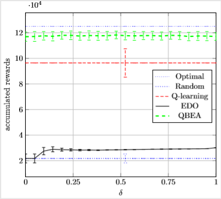
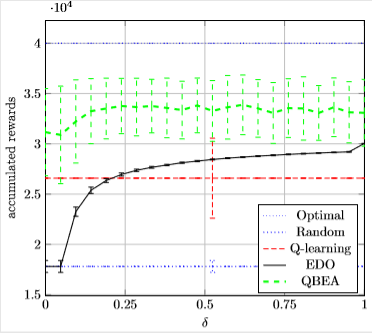
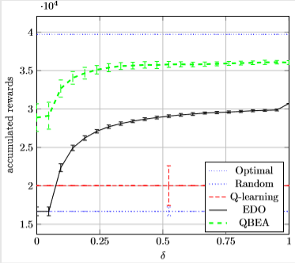

# Sequential Decison Making Problems (SDMPs)

Code for experiments based on work in the following papers:

* Fu, Haobo, et al. "What are dynamic optimization problems?." Evolutionary Computation (CEC), 2014 IEEE Congress on. IEEE, 2014.
* Fu, Haobo, Peter R. Lewis, and Xin Yao. "A Q-learning Based Evolutionary Algorithm for Sequential Decision Making Problems.

Q-Learning is an implementation of Q Learning from Watkins, Christopher John Cornish Hellaby. 
Learning from delayed rewards. Diss. University of Cambridge, 1989.
Link (http://www.cs.rhul.ac.uk/~chrisw/thesis.html)

Implementation of the Particle Swarm Optimisation using Restart (RPSO) 

* Clerc, Maurice, and James Kennedy. "The particle swarm-explosion, stability, and convergence in a multidimensional complex space." Evolutionary Computation, IEEE Transactions on 6.1 (2002): 58-73.

## Outputs

Aman Soni, Peter R. Lewis and Anikó Ekárt. "Offline and Online Time in Sequential Decision-Making Problems" Computational Intelligence in Dynamic and Uncertain Environments(CIDUE),2016 IEEE Symposium on. IEEE, 2016.

|  |
| --- |
| Oscilliating Environment - Large Bias |

|  |
| --- |
| Oscilliating Environment - Small Bias |

|  |
| --- |
| Cyclical Environment - Large Bias |

|  |
| --- |
| Cyclical Environment - Small Bias |

## Settings

| Setting | Description | Value |
| --- | --- | ---|
| Steps | Number of time steps per run | 1000 |
| Repeat | Number of repeat run  for each experiment | 100 |

### Random Seeds

| 1245097796 | 1661198952 | 122864260 |
| -1728364941 | -1610161142| -1553747733| 
|-1514202174 | 1222408005| -1578471556| 
|521614943| -389764704| -1649559921| 
|1994886919| 2034262993| 1507881027| 
|-545858353| -654192656| 1185726362| 
|-1836349758| -1022557879| -552194205| 
|-1345255965| -1203435676| -1341362130| 
|-472864820| -2051027606| -565293299| 
|-1779308806| 1373421413| -1688259451| 
|849821684| 1298182941| -2055738353| 
|903731815| -1166050407| -1822845219| 
|-827989914| 1621600417| 1009567734| 
|1778423930| -1967909361| 1444884716| 
|-922348556| 1137581970| 2025531731| 
|2003346213| -611987680| -1528167225| 
|-526263823| 920625048| -720533346| 
|-1858766946| -133249745| 581003648| 
|-1378875043| 108191402| -1846334158| 
|-349618738| 805723531| 659101161| 
|-1792384625| -577449431| 552042827| 
|2144448365| -900817631| 503529526| 
|1025615013| -1254614466| 832400668| 
|-857677544| 386874046| -370551938| 
|2094200162| -1105797830| 1372670024| 
|1966474702| 1334093332| 457012299| 
|-1189370565| 842873584| 804861548| 
|240927114| -1726536252| 1962410925| 
|1409611978| -910950333| -142025090| 
|-1624917511| -1102128116| 247567512| 
|-693307425| -1201487532| 299085346| 
|-480093052| 505857268| 1454893426| 
|-1866304544| -604107491| -1102114480| 
|1978324765 | | |
